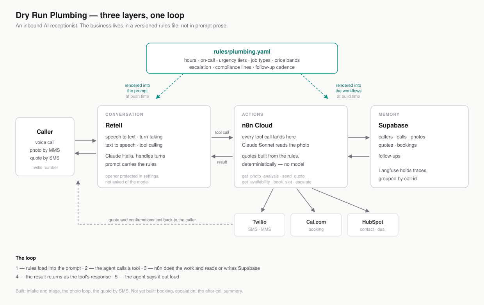
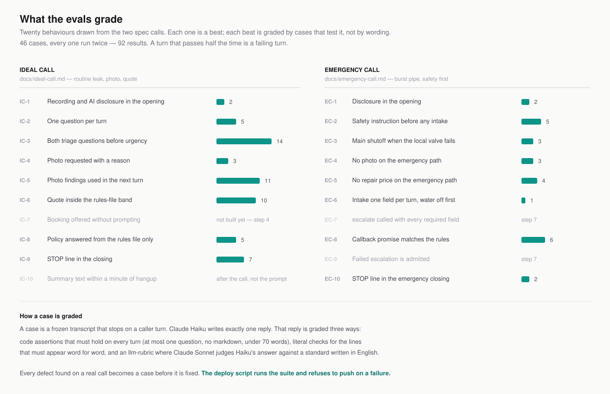

# Dry Run Plumbing

A voice agent that does more than talk. While the caller is still on the line it can take a photo by text, look at it, and use what it sees in the next thing it says. The voice call and the text thread are one conversation, not two tickets someone reconciles in the morning.

It is dressed as the after-hours receptionist for a plumbing company: it triages the problem, reads the photo, and sends a preliminary quote by SMS before hanging up. The company is fictional. The system is real and callable, with a Canadian phone number, a live Retell agent, n8n workflows, a Supabase database, and real texts going out through Twilio.

None of it is specific to plumbing. The intake logic runs off a rules file, so the same agent handles any call where someone describes a problem, shows it, and wants an answer before they hang up. Hours, urgency tiers, job types, price bands and escalation live in one versioned YAML file rather than in prompt prose, and swapping that file swaps the business.

Read the case study: [nurgazy.com/work/dry-run-plumbing](https://nurgazy.com/work/dry-run-plumbing)

## What a call looks like

> **Agent:** Thanks for calling Dry Run Plumbing's after-hours line. Quick heads up, this call is recorded and you're speaking with an AI assistant. How can I help?
> **Caller:** There's water dripping under my kitchen sink, I've got a bucket under it right now.
> **Agent:** Sorry to hear that. Is it a slow drip, or is water actually running?

Two triage questions settle the urgency tier. Intake is collected one field per turn. The agent explains why a photo helps, waits for the caller to say it's sent, then calls a tool that returns what Claude Sonnet saw in the image. The quote comes from a price band in the rules file — no model picks the number — and goes out by SMS after verbal consent is captured on the recording.

`docs/ideal-call.md` is the specification: that call written as a two-column transcript, what is said beside what the system does, plus the ten beats the evals grade. `docs/emergency-call.md` is the second spec — burst pipe, safety instruction before intake, no photo, no price.

## Status

Live on the number and verified by real calls:

- Intake and triage, with the urgency tier settled from the caller's own answers
- The photo loop: inbound MMS, Claude Sonnet vision, `get_photo_analysis` answering mid-call
- Re-triage once the photo lands, since a picture can raise the tier but never lower it
- Quote by SMS through `send_quote`, with verbal consent captured on the recording first
- The emergency path: safety instruction before intake, no photo, no price

Next, in order: booking through Cal.com, the after-call summary and CRM write, then escalation to an on-call number. Each one is an n8n workflow behind a tool that is already defined in `agent/tools.json`, so the intake logic does not change as they land.

The prompt is written so the agent only claims what is true of the system today.

## Architecture



Three layers, one loop.

**Conversation** — Retell runs the live call: speech to text, turn-taking, text to speech, tool calling. Claude Haiku 4.5 handles turns through Retell's built-in LLM. The rules file is rendered into the system prompt at push time, not fetched at call time.

**Actions** — n8n Cloud. Every tool call from the agent and every Retell or Twilio webhook lands on an n8n webhook. n8n calls Claude Sonnet for photo analysis, builds quotes deterministically from the rules file, and talks to Twilio, Supabase, Cal.com and HubSpot.

**Memory** — Supabase Postgres: callers, calls, photos, quotes, bookings. Langfuse holds traces.

The loop: rules load into the prompt → the agent calls a tool → n8n does the work and reads or writes Supabase → the result returns as the tool's response → the agent says it out loud.

`docs/architecture.md` has the detail, including data routing and the compliance surface.

## The rules file

`rules/plumbing.yaml` holds the business: hours, on-call, urgency tiers, job types with price bands, escalation rules, compliance lines. `rules/schema.json` says what a valid rules file must contain.

Two things read it. `agent/push.ts` renders it into the system prompt before deploying to Retell. `workflows/build.js` renders the subset the workflows need into each n8n workflow file, between marker comments, so a price band has exactly one source.

The reason for the split is a lesson that cost a debugging session and is recorded in `docs/decisions.md`: **when the prompt and the rules file disagree, the model follows the rules file.** Anything the agent must get right belongs in structured data, not in prose asking it nicely. Anything it must say word for word is protected by structure — the opener lives in Retell's own settings, not in the prompt.

## Evals



`npm run evals`

The eval suite grades behaviour, not wording. A case is a frozen transcript that stops on a caller turn; the model writes exactly one reply; assertions grade that reply. Some are deterministic code checks (at most one question mark, no markdown, no dollar figure on the emergency path). Some are `llm-rubric` assertions where Claude Sonnet judges Haiku's answer against a standard written in English. Every case runs twice, because a turn that passes half the time is a failing turn.

`evals/beats.yaml` is the registry of every graded behaviour across both spec calls — what it is, which file and key grounds it, and the build step that makes it testable. Cases tag the beats they cover, and `node evals/coverage.js` reports behaviours that are testable now but have no case.

`agent/push.ts` runs the suite and refuses to deploy on a failure. Every defect found on a real call becomes a case before it's fixed.

## Layout

```
agent/       prompt, tool definitions, settings, and the push script
rules/       plumbing.yaml (the business) and schema.json (what's valid)
workflows/   n8n workflows as code, one file per workflow
supabase/    schema as SQL migrations
evals/       promptfoo config, cases, beats registry, fixtures
docs/        the specs, architecture, decisions log, status
```

`docs/decisions.md` is one line per non-obvious decision, dated, newest first. `docs/status.md` is where the project actually stands.

## Running it

```
cp .env.example .env          # fill in the keys you need
node agent/push.ts --dry-run  # render and validate, touch nothing
npm run evals                 # run the suite (costs ~$1 in Anthropic credits)
npm run push                  # render, validate, run evals, deploy on green
```

The first push creates the Retell LLM and agent and writes their ids back to `.env`; later pushes update them in place. Model, temperature, voice and the opener live in `agent/settings.json`.

## Stack

Retell · Claude (Haiku for turns, Sonnet for vision) · n8n Cloud · Supabase · Twilio · Cal.com · HubSpot · Promptfoo · Langfuse

## License

MIT. See `LICENSE`.
